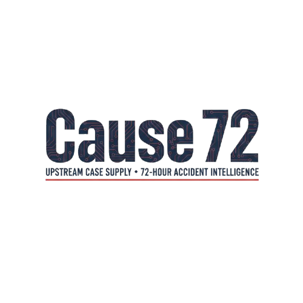

# B2B Lead-Gen Template Standards
> Inject this file as context when building any new page on this template.
> These rules are mandatory. Deviating from them causes layout regressions.

---

## 1. Header / Nav

### Rule
Header height is controlled **only by padding + logo max-height**. Never use `height` or `overflow: hidden` on the header element — it clips content.

### Mandatory CSS
```css
.site-header {
    background-color: var(--bg-header);
    border-bottom: 1px solid var(--glass-border);
    padding: 0 20px;
    position: sticky;
    top: 0;
    z-index: 1000;
}

.header-inner {
    max-width: 1170px;
    margin: 0 auto;
    display: flex;
    align-items: center;
    justify-content: space-between;
    padding: 12px 5px;        /* 12px top + 40px logo + 12px bottom = ~64px total */
}

.header-logo-col {
    width: 29.1%;
}

.header-logo {
    max-height: 40px;         /* ASSET SLOT: any logo dropped here stays within ~64px header */
    width: auto;
    display: block;
    transform-origin: left center;
    transition: transform 0.3s ease, opacity 0.3s ease;
}
```

### Mandatory HTML structure
```html
<header class="site-header">
    <div class="header-inner">
        <div class="header-logo-col">
            <a href="/"></a>
        </div>
        <div class="header-cta-col desktop-only">
            <a href="schedule-call" class="cta-btn-nav">Schedule Strategy Call</a>
        </div>
    </div>
</header>
```

### ❌ Common Mistakes
- `position: fixed` on header — requires manual `padding-top` offset on every single page section. Use `position: sticky` instead.
- `height: 64px` + `overflow: hidden` — clips the CTA button and any dynamic content.
- `width: 60%` on `.footer-logo img` — makes a wide logo extremely tall. Always use `max-height`.

---

## 2. Content Constraint (Section Inner)

Every section's content must be wrapped in `.section-inner`. This applies the universal max-width and horizontal padding. **Every page must define this class.**

### Mandatory CSS
```css
.section-inner {
    max-width: 1170px;
    margin: 0 auto;
    padding: 0 20px;
}
```

### Usage in HTML
```html
<section class="some-section">
    <div class="section-inner">
        <!-- all content here -->
    </div>
</section>
```

### ❌ Common Mistakes
- Copying the footer HTML from the homepage (which uses `.section-inner`) without also copying the CSS rule. Content runs edge-to-edge on the new page.
- **Flex column overflow** — Any flex child that contains long text (headlines, token placeholders) must have `min-width:0`. Without it, the child refuses to shrink below its content width and pushes sibling columns off-screen. Always add `min-width:0` to `.text-col`, `.hero-left`, and any other flex child that holds text content.
- **Headline word-break** — Long words (especially `[TOKEN]` placeholders and hyphenless proper nouns) don't wrap by default. Always add `overflow-wrap:break-word; word-break:break-word` to `.hero-headline` and other large display text classes.


---

## 3. Footer

### Rule
Footer uses the same `.section-inner` content constraint. Logo uses a fixed `height` (not `width: %`) to prevent tall footers.

### Mandatory CSS
```css
.site-footer {
    border-top: 1px solid var(--glass-border);
    padding: 40px 0;
}

.footer-inner {
    display: flex;
    align-items: center;
    justify-content: space-between;
}

.footer-left {
    display: flex;
    flex-direction: column;
    gap: 10px;
}

.footer-logo {
    height: 60px;             /* Fixed height — scales any logo consistently */
    width: auto;
}

.footer-tagline {
    color: #cccccc;
    font-family: var(--contentfont);
    font-size: 1rem;
}

.footer-right {
    color: #cccccc;
    font-family: var(--contentfont);
    font-size: 0.9rem;
    text-align: right;
}
```

### Mandatory HTML structure
```html
<footer class="site-footer">
    <div class="section-inner">
        <div class="footer-inner">
            <div class="footer-left">
                <a href="/"></a>
                <span class="footer-tagline">The Intelligence Layer Behind Top PI Firms</span>
            </div>
            <div class="footer-right">
                © 2026 Cause72. All rights reserved.
            </div>
        </div>
    </div>
</footer>
```

---

## 4. Main Section Top Padding

When using `position: sticky` on the header, **do not add a manual offset to main content**. Sticky headers flow naturally in the document — there is no content hiding.

```css
/* CORRECT — sticky header, no offset needed */
.main-section {
    padding: 6rem 5% 60px;
}

/* WRONG — only needed with position: fixed */
.main-section {
    padding: 104px 5% 60px;
}
```

---

## 5. Glass Cards & Tilt Hover

The tilt/glow system is driven by JS (`querySelectorAll('.tilt-hover')`). Any card that should have 3D tilt + teal glow on hover just needs the class. CSS hover rules on those same elements will **compete and weaken** the `.is-hovered` glow — remove any `:hover` block from cards using `.tilt-hover`.

```html
<div class="glass-card tilt-hover animate-up">
    <!-- content -->
</div>
```

```css
/* DO NOT add a :hover rule on .tilt-hover elements */
/* .glass-card:hover { ... }  <-- this fights .is-hovered */
```

---

## 7. Brand Update Process

Use this checklist whenever onboarding a new client or updating an existing brand.

### A. Logo

| Slot | CSS property | Value |
|---|---|---|
| Header (homepage) | `max-height` on `.header-logo` | `40px` |
| Header (schedule page, v2) | `max-height` on `.header-logo` | `72px` |
| Footer | `height` on `.footer-logo` | `60px` |

- File format: **PNG with transparent background** (preferred) or SVG
- Drop file into `assets/logo/`
- Update all `src="assets/logo/[LOGO_PATH]"` and `alt="[BRAND_NAME]"` tokens
- ❌ Never use `width: XX%` on logo images — always use `height` or `max-height` with `width: auto`

### B. Favicon

Every page `<head>` must include a favicon. Without it browsers show a blank tab icon.

```html
<!-- Add these lines to <head> on EVERY page -->
<link rel="icon" type="image/png" href="assets/favicon/favicon-32.png" sizes="32x32">
<link rel="icon" type="image/png" href="assets/favicon/favicon-16.png" sizes="16x16">
<link rel="apple-touch-icon" href="assets/favicon/favicon-180.png">
```

**Generating favicons — three hard requirements:**

1. **Source must be square.** A wide rectangular logo (e.g. 300×80px) at 16px becomes an unreadable sliver. Use a square icon/mark version of the logo, not the full wordmark.
2. **Source PNG must be resized to standard sizes.** Linking the raw logo file at any non-standard size (e.g. 101×92px) causes Chrome to silently reject the favicon and fall back to the page title's first letter.
   - Use [favicon.io](https://favicon.io) or [realfavicongenerator.net](https://realfavicongenerator.net) to generate the package
   - Copy `favicon-16.png`, `favicon-32.png`, `favicon-180.png` into `assets/favicon/`
   - ❌ Never link directly to the full logo PNG file as a favicon
3. **Page `<title>` must be brand-first.** When Chrome collapses a tab, it shows the first letter of the page title — not the favicon. Brand name must be first so every tab shows the brand initial.
   - ✅ `Cause72 | Schedule a Call`
   - ❌ `Schedule a Call — Cause72`


### C. Color Palette

All colors are driven by two CSS variables in `:root`. Change only these two lines per client:

```css
:root {
    --accent:       #00c9b8;  /* Primary brand color — buttons, icons, accents */
    --accent-hover: #00e5d1;  /* Lighter hover variant (~15% lighter than accent) */
}
```

**Three requirements — all must pass before approving a color:**

#### Rule 1 — Contrast Ratio: minimum 4.5:1 against `#0b121b`
The accent must meet **WCAG AA** for buttons and text on our dark body background.

> **Check it:** [contrast-ratio.com](https://contrast-ratio.com) — enter accent hex vs `#0b121b`

| Example | Ratio | Result |
|---|---|---|
| `#00c9b8` teal | 8.6:1 | ✅ pass |
| `#0077cc` blue | 4.6:1 | ✅ pass (barely) |
| `#1a4a7a` dark navy | 1.8:1 | ❌ fail |
| `#2d6a4f` dark green | 2.1:1 | ❌ fail |

#### Rule 2 — Lightness: minimum 50% HSL lightness
The glow and glass effects use `rgba(accent, 0.15–0.4)` layers over dark backgrounds. **If the accent is too dark, these layers are invisible** — the glow disappears even though the CSS is correct. This was the exact issue we hit early in this project.

> **Check it:** Convert hex → HSL at [hslpicker.com](https://hslpicker.com). L must be ≥ 50%.

> **Exception:** Extreme-chroma cyans/teals can look correct below 50% L due to high perceived brightness. When in doubt, run the browser glow test below.

#### Rule 3 — Saturation: minimum 60% HSL saturation
Muted or near-grey colors produce muddy, barely-visible glow effects regardless of lightness. Greys as accents always fail on this template.

---

**30-second browser glow test:**
1. Open `index.html` in the browser with the new accent color applied
2. DevTools → Inspector → select `.trust-shield-icon` → verify the pulsing glow is clearly visible
3. Hover any `.glass-card` → verify the teal border glow appears
4. If either is invisible → accent is too dark. Increase HSL lightness until both pass.

---

**Other rules:**
- Never hardcode accent colors anywhere except these two `:root` lines — all elements reference `var(--accent)` automatically
- Background/glass colors are fixed dark values — do not change them unless the full design direction changes
- To derive `--accent-hover`: increase HSL lightness by 10–15% from `--accent`


---

## 8. Calendar Embed

### Rule
**Embed code is required.** The calendar must render inline on the page. Do not use a redirect link, a button that opens a new tab, or an iframe pointing to an external booking URL.

### Approved Embed Methods

**Calendly** (most common):
```html
<!-- Step 1: Paste in <head> -->
<link href="https://assets.calendly.com/assets/external/widget.css" rel="stylesheet">

<!-- Step 2: Paste in the calendar column, replacing the placeholder div -->
<div class="calendly-inline-widget"
     data-url="https://calendly.com/YOUR-USERNAME/YOUR-MEETING-TYPE"
     style="min-width:320px;height:700px;">
</div>
<script type="text/javascript"
        src="https://assets.calendly.com/assets/external/widget.js"
        async></script>
```

**Cal.com**:
```html
<!-- Paste in the calendar column -->
<cal-inline calLink="YOUR-USERNAME/YOUR-MEETING-TYPE"
            style="min-width:320px;height:700px;"></cal-inline>
<script src="https://cal.com/embed.js" defer></script>
```

**HubSpot Meetings**:
```html
<!-- Paste in the calendar column -->
<div class="meetings-iframe-container"
     data-src="https://meetings.hubspot.com/YOUR-LINK?embed=true">
</div>
<script type="text/javascript"
        src="https://static.hsappstatic.net/MeetingsEmbed/ex/MeetingsEmbedCode.js">
</script>
```

### ❌ Not Acceptable
- `<a href="https://calendly.com/...">Book a call</a>` — sends user away from the site
- `<iframe src="...">` without provider-supplied embed script — breaks on mobile
- Placeholder card left in place at launch

---

## 9. Config Block + Dark/Light Mode

### Config Block (top of every HTML file)
The `<html>` tag carries two data attributes that control build-time behaviour. Set them before client delivery.

```html
<!--
  SITE CONFIG
  THEME:   dark | light
  CHECKER: dev  | off  ← remove before launch
-->
<html lang="en" data-theme="dark" data-checker="dev">
```

| Attribute | `dark` | `light` |
|---|---|---|
| `data-theme` | Dark glass, teal glows (default) | Frosted white glass, stronger glows |
| `data-checker` | `dev` = contrast widget visible | `off` = hidden |

**To deliver to client:** change `data-checker="dev"` → `data-checker="off"`. That's the only pre-launch change needed.

### Light Mode Glass Rules
Light mode inverts the glass system. The CSS `[data-theme="light"]` block is already in both template files — these are the key overrides:

| Variable | Dark value | Light value |
|---|---|---|
| `--bg-body` | `#0b121b` | `#f0f4f8` |
| `--bg-header` | `#0a0e17` | `#ffffff` |
| `--glass-bg` | `rgba(15,23,42,0.6)` dark | `rgba(255,255,255,0.75)` frosted white |
| `--glass-border` | `rgba(255,255,255,0.1)` | `rgba(0,0,0,0.08)` |
| `--text-color` | `#94a3b8` | `#475569` |
| `--white` (headlines) | `#ffffff` | `#1e293b` |

Glow animations are boosted in light mode (`shield-pulse-light` keyframe) to maintain visibility against the lighter background.

### Contrast Checker Widget
A floating badge (bottom-left) that reads live CSS variables and shows:
- Contrast ratio of `--accent` vs `--bg-body`
- HSL lightness and saturation pass/fail

It re-evaluates automatically when `data-theme` changes. Driven entirely by `data-checker="dev"` — no code to delete, just flip the attribute to `off`.

---


Before shipping any new page built on this template:

- [ ] `<header class="site-header">` structure matches exactly
- [ ] `.section-inner` CSS is defined in this page's `<style>` block (or linked stylesheet)
- [ ] `<footer class="site-footer">` structure matches exactly
- [ ] No `height` + `overflow: hidden` on the header
- [ ] No `width: XX%` on logo images — use `max-height` or `height` with `width: auto`
- [ ] Main section padding uses `6rem` top (not a pixel offset)
- [ ] Tilt cards do not have a competing `:hover` CSS rule
- [ ] Favicon tags present in `<head>` on every page (see Section 7B)
- [ ] Brand colors updated in `:root` — only `--accent` and `--accent-hover` changed (see Section 7C)
- [ ] Calendar embed is **inline embed code**, not a redirect link (see Section 8)
- [ ] No `[TOKEN]` placeholders remaining — search for `[` to confirm
- [ ] `data-checker` changed from `dev` → `off` before client delivery (see Section 9)
- [ ] `data-theme` set to intended default (`dark` or `light`) before client delivery
- [ ] Contrast checker verified: all three checks pass in chosen theme (Section 7C + 9)

